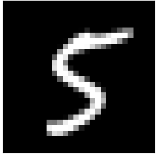

# Replication package for the paper: "Can Optimization-Driven Search-Based Testing Effectively Cover Failure-Revealing Test Inputs? Insights from Two DL-Enabled Case Studies"
This repository holds the implementation and evaluation results of the study in the paper "Can Optimization-Driven Search-Based Testing Effectively Cover Failure-Revealing Test Inputs? Insights from Two DL-Enabled Case Studies".

# Results

## AVP


The results of the AVP Case Study can be found [here](results-avp/). It contains:

- The generated test case for each run: [results-avp\runs](results-avp/runs/)
- Coverage results using the CID metric: [results-avp\cid](results-avp/cid)

The corresponding reference sets used for CID evaluation can be found here: [ref-set\avp\oracle-variation](ref-set/avp/oracle-variation/) 

The suffix of the files represents the restriction level of the oracle used. 

CID results related to different sampling approaches (sampling size and sampling method variation) for a fixed test oracle can be found here: [sampling\variation](sampling-variation/) \
Eeach folder is labeled according to `<samplingmethod>_<resolution>`. The results contain for instance a list of all evaluated test cases, failing test cases, the visualization of all test cases in the design space and objective space. For further information which are results are written please have a look in the documentation of OpenSBT.


## MNIST



The results of the AVP Case Study can be found here: [results-mnist](results-mnist)
- The used model for the digit classification is available here: [model](https://github.com/ast-fortiss-tum/coverage-emse-24/blob/main/code/code-mnist/problem/mnist/models/model_mnist.h5)
- The generated test case for each run for all used seed digits  are available here: [results-mnist\runs](results-mnist/runs/)
- Coverage results for on average 20 seeds are given here: [results-mnist\cid](results-mnist/cid/). Coverage results for each individual seed for the selected oracle `<oracle>` given can be found in the folder named `results-mnist/runs/multiseed_<oracle>`. Statistical test results are located in the file named `cid_significance.csv`.

This folder contains for each seed a folder with the results of 10 runs for the algorithms RS, NSGA-II and NSGA-II-D. For instance, generated test cases for the seed digit 102 can be found here: [results-mnist\runs\multiseed_CriticalMNISTConf_05\MNIST_3D_RS_D102](results-mnist/runs/multiseed_CriticalMNISTConf_05/MNIST_3D_RS_D102). The coverage results for digit 102 are available in the folder named `comparison_['RS', 'NSGA-II-D', 'NSGA-II']`.

The corresponding reference set for CID evaluation is located in the folder named `ref_set` inside the results folder. All seed digits from MNIST with their corresponding number that have the label 5 are given [here](code\code-mnist\problem\mnist\bootstrap\bootstrap_five.png).


# Implementation

The implementation of the test case generation and evaluation for the MNIST Case Study is available in the folder [\code](code). For the AVP Case Study the SUT could not have been disclosed, as the system was provided by our industrial partner. Both case studies have been implemented using the open-source search-based testing framework [OpenSBT](https://git.fortiss.org/opensbt).

## Preliminaries

First make sure that your system meets the requirements mentioned by OpenSBT (s. [here](https://git.fortiss.org/opensbt/opensbt-core)) and MNIST implementation by Vincenzo et al. (https://github.com/testingautomated-usi/DeepJanus):

Create a virtual environment and install all requirements by:

```bash
pip install -r requirements.txt
```

For troubleshooting related to MNIST dependencies we refer to the original implementation by Vincenzo et al. (https://github.com/testingautomated-usi/DeepJanus).

## Test Case Generation

a) To start the generations of test cases for one single seed run:

```python
python analysis.py -s <seed_number>
```

b) To start the generations of test cases for **multiple seeds** use the script:

```python
run_analysis_seeds.sh
```

Modify the seed numbers in `line 7` to use different seeds for the evaluation. All seed digits from MNIST with their corresponding number that have the label 5 are given [here](code\code-mnist\problem\mnist\bootstrap\bootstrap_five.png). Results are written by default in the folder named `results/analysis/multiseed/`.


## Evaluation

To start the evaluation:

```python
python analysis.py -p "/path/to/the/folder/with/runs/"
```

The evaluation results will be written in the folder of the passed path of the runs.

To get results with a different test oracle for already generated test inputs you need to execute:

```python
python -m scripts.generate_multiseed_variation
```


The oracle function(s) used need(s) to be specified inside the script in line 180. To create a customized oracle function you can use the Criticality class/interface from OpenSBT. When the script execution is finished, for each test oracle a new folder will be created with the name
`<original_folder_name>_<oracle_function_name>`. Seed results are read by default from the folder named `results\analysis\multiseed\`. By default, a reference set using grid sampling with 10 samples per dimension will be generated. To modify
the sampling resolution, update the variable [here](code/code-mnist/utils/sampling.py) in line 33. You can also provide a reference set generated using a different sampling approach. The provided set should be compliant with the format given in the refence set file [here](TODO) and have to be placed in the folder of a run.

When the evaluation is finished, three files are generated:
- `avg_combined`: This files holds the averaged CID and standard deviation results over all seed digits for the algorithms NSGA-II, NSGA-II-D and RS.
- `cig_significance`: This file contains the statistical test results for the comparison RS/NSGA-II and RS/NSGA-II-D including the p-value and effect-size evaluation.
- `overview_cid`: This file contains CID values after the final evaluation on average for each run.

An example can be found [here](results-mnist/cid/crit_large/).
# Authors


Lev Sorokin (sorokin@fortiss.org), \
Damir Safin (safin@fortiss.org)

Automated Software Testing \
fortiss GmbH \
Munich, Germany 
